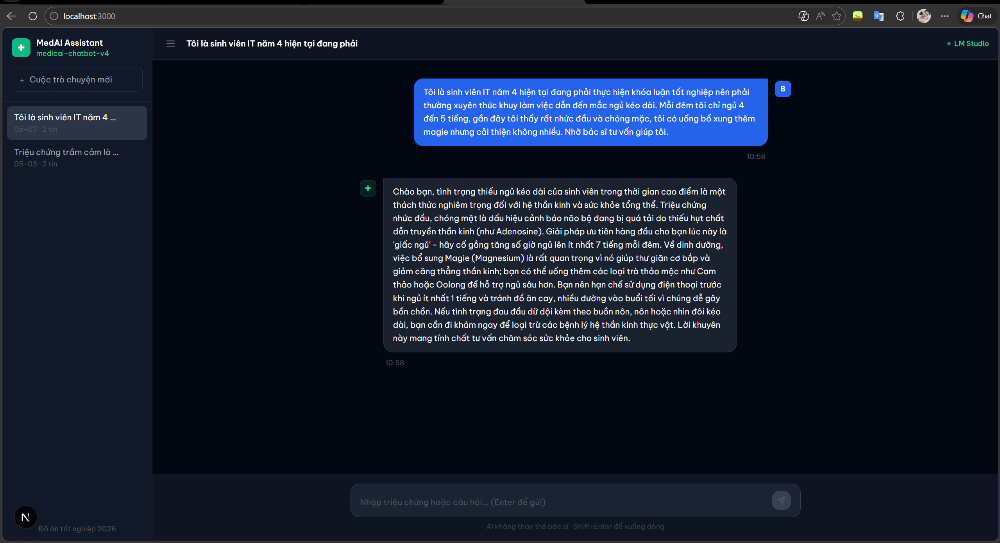

# 🩺 Medical AI Assistant

> Giao diện web demo cho mô hình LLaMA 3 8B đã fine-tune chuyên biệt lĩnh vực y tế tiếng Việt.  
> Đồ án tốt nghiệp — Khoa Công Nghệ Thông Tin — 2025

---

## 📸 Demo



**Tính năng chính:**

- 💬 Hội thoại đa lượt với nhớ ngữ cảnh đầy đủ
- ⚡ Streaming real-time từng token như ChatGPT
- 🗂️ Lịch sử nhiều cuộc hội thoại (sidebar)
- ✏️ Chỉnh sửa câu hỏi, thử lại câu trả lời, copy nội dung
- 🌙 Dark theme chuyên nghiệp, font Be Vietnam Pro hỗ trợ tiếng Việt
- 📱 Responsive trên mọi kích thước màn hình

---

## 🛠️ Tech Stack

| Tầng       | Công nghệ                                      |
| ---------- | ---------------------------------------------- |
| Frontend   | Next.js 16 + TypeScript                        |
| Styling    | Tailwind CSS v3                                |
| Font       | Be Vietnam Pro (Google Fonts)                  |
| AI Runtime | LM Studio (OpenAI-compatible API)              |
| Mô hình    | LLaMA 3 8B — fine-tuned (`medical-chatbot-v4`) |
| Giao thức  | SSE Streaming (`/v1/chat/completions`)         |

---

## ⚙️ Yêu Cầu Hệ Thống

- **Node.js** >= 18
- **LM Studio** >= 0.3.x — [Tải tại đây](https://lmstudio.ai)
- **RAM** >= 12GB (khuyến nghị 16GB)
- Mô hình GGUF `medical-chatbot-v4` đã được load trong LM Studio

---

## 🚀 Cài Đặt & Chạy

### 1. Clone repository

```bash
git clone https://github.com/hieule1704/medical_chatbot_interface
cd medical_chatbot_interface
```

### 2. Cài đặt dependencies

```bash
npm install
```

### 3. Tạo file `.env.local`

```bash
cp .env.example .env.local
```

Nội dung `.env.local`:

```env
OPENAI_API_KEY=lm-studio
OPENAI_BASE_URL=http://127.0.0.1:1234/v1
```

### 4. Khởi động LM Studio

1. Mở LM Studio
2. Load model `medical-chatbot-v4` (GGUF)
3. Vào tab **Local Server** → bấm **Start Server**
4. Đảm bảo server chạy tại `http://127.0.0.1:1234`

### 5. Chạy ứng dụng

```bash
npm run dev -- --turbo=false
```

Mở trình duyệt tại [http://localhost:3000](http://localhost:3000)

---

## 📁 Cấu Trúc Project

```
medical-ai-interface/
├── app/
│   ├── api/
│   │   └── chat/
│   │       └── route.ts      # API endpoint — kết nối LM Studio
│   ├── globals.css            # Tailwind base styles
│   ├── layout.tsx             # Root layout + Be Vietnam Pro font
│   └── page.tsx               # Giao diện chat chính
├── public/
│   └── demo.png               # Screenshot demo
├── .env.local                 # Biến môi trường (không commit)
├── .env.example               # Template biến môi trường
├── next.config.ts             # Cấu hình Next.js
├── tailwind.config.js         # Cấu hình Tailwind CSS
└── postcss.config.mjs         # PostCSS config
```

---

## 🔄 Luồng Hoạt Động

```
Người dùng nhập câu hỏi
        ↓
React state (page.tsx) — lưu toàn bộ conversation history
        ↓
POST /api/chat — gửi mảng messages {role, content}
        ↓
route.ts — forward đến LM Studio kèm system prompt
        ↓
LM Studio POST /v1/chat/completions (stream: true)
        ↓
medical-chatbot-v4 — generate tokens, trả về SSE stream
        ↓
route.ts parser — chuyển đổi sang format 0:"token"
        ↓
Browser ReadableStream — cập nhật UI từng token real-time
```

---

## 🤖 Về Mô Hình Fine-Tuned

| Thông tin          | Chi tiết                                           |
| ------------------ | -------------------------------------------------- |
| Base model         | Meta LLaMA 3 8B                                    |
| Kỹ thuật fine-tune | QLoRA (Quantized Low-Rank Adaptation)              |
| Domain             | Y tế, sức khỏe tâm thần, tư vấn bệnh lý tiếng Việt |
| Output artifacts   | LoRA adapter weights + GGUF export                 |
| Quantization       | Q4_K_M (~5GB RAM)                                  |
| Inference speed    | ~5.5 tokens/giây (CPU-only)                        |

---

## ⚠️ Lưu Ý Quan Trọng

> **AI không thay thế bác sĩ.** Hệ thống này chỉ mang tính chất demo và hỗ trợ thông tin ban đầu. Người dùng cần tham khảo bác sĩ chuyên khoa cho các vấn đề sức khỏe nghiêm trọng.

---

## 📄 License

MIT License — Sử dụng tự do cho mục đích học thuật và nghiên cứu.

---

<p align="center">
  Đồ Án Tốt Nghiệp 2026 &nbsp;|&nbsp; Khoa Công Nghệ Thông Tin
</p>
